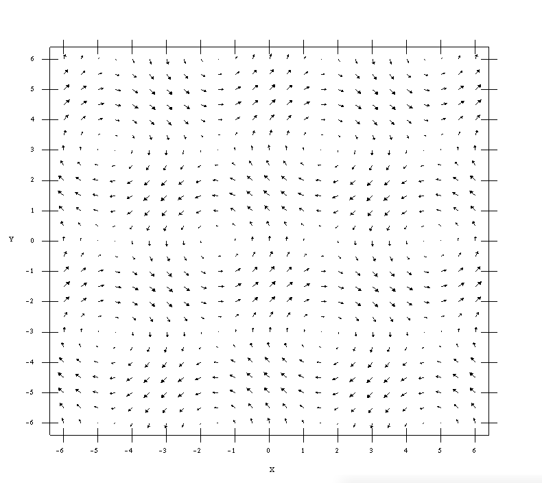
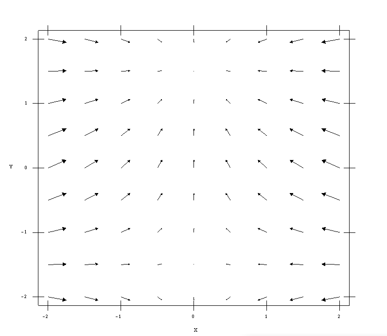

# Vector Functions with OpenGL/C++ 

This project can be use as C++ library or as graphic interface, in this moment, we just use as **library**.

# Examples
## <p align="center"> F(x,y)=(-y,x) </p>
<p align="center">
  
</p>

## <p align="center"> F(x,y)=(cos[-y],sin[x]) </p>
<p align="center">
  
</p>

## <p align="center"> F(x,y)=(-x,cos[y]) </p>
<p align="center">
  
</p>

# Compile

## OpenGL and Glut
You must have OpenGL and Freeglut in your pc

## Make

Follow the next instructions

```bash
make build
make
```
the executable file is in build/Examples.

# Call in C++

```C++
void display(){
  glClear(GL_COLOR_BUFFER_BIT);
  glColor3f(0.0f, 0.0f, 0.0f);
  Field Func("+y^2","-x");            //Call the function
  Func.SetXYMaxMin(10, 10, 0.05f);    //Range of x and y, and vector size
  Func.SetXYVectorsQuanty(0.5, 0.2);  //Number of vector into the x and y range

  glutSwapBuffers();
}

```

# List of posible equations
- f(x,y) = (x,y)     write "x" or "y"
- f(x,y) = (x²,y²)   write "x^2", "x\*x" or "y^2", "y\*y"
- f(x,y) = (x³,y³)   write "x^3", "x\*x\*x" or "y^3", "y\*y\*y"
- f(x,y) = (x⁴,y⁴)   write "x^4", "x\*x\*x\*x" or "y^4", "y\*y\*y\*y"

## Trigonometric equations
- write sin(...)    Sine 
- write cos(...)    Cosine
- write tan(...)    Tangent
- write csc(...)    Cosecant
- write sec(...)    Secant
- write ctg(...)    Cotangent
- write asi(...)    ArcSine
- write aco(...)    ArcCosine
- write ata(...)    ArcTangent
- write sih(...)    Hyperbolic Sine
- write coh(...)    Hyperbolic Cosine
- write tah(...)    Hyperbolic Tangent

## Other functions
- write exp(...)    Exponential base e
- write log(...)    Logarithm base e
- write abs(...)    Absolute value
