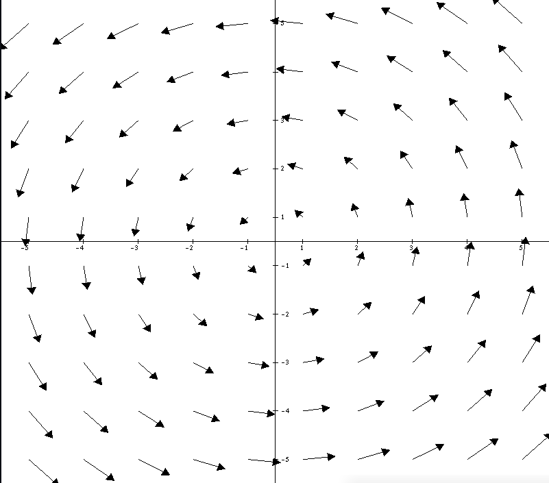

# Vector Functions with OpenGL/C++ 

This project can be use as C++ library or as graphic interface, in this moment, we just use as **library**.

# Example F(x,y)=(-y,x)



# List of posible equations
- f(x,y) = (x,y)     write "x" or "y"
- f(x,y) = (x²,y²)   write "x^2", "x\*x" or "y^2", "y\*y"
- f(x,y) = (x³,y³)   write "x^3", "x\*x\*x" or "y^3", "y\*y\*y"
- f(x,y) = (x⁴,y⁴)   write "x^4", "x\*x\*x\*x" or "y^4", "y\*y\*y\*y"

# Call in C++

```C++
void display(){
  glClear(GL_COLOR_BUFFER_BIT);
  glColor3f(0.0f, 0.0f, 0.0f);
  Field Func("+y^2","-x");            //Call the function
  Func.SetXYMaxMin(10, 10, 0.05f);    //Range of x and y, and vector size
  Func.SetXYVectorsQuanty(0.5, 0.2);  //Number of vector into the x and y range

  glutSwapBuffers();
}


